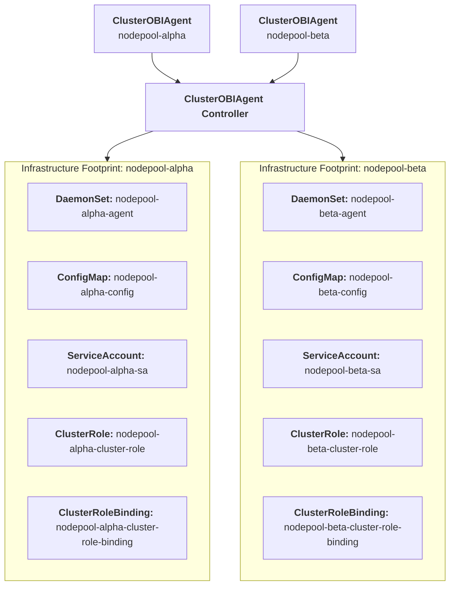

# Design Document: Introducing the ClusterEBPFAgent Controller

## 1. Summary

This proposal introduces a new cluster-scoped Custom Resource Definition (CRD) named `ClusterEBPFAgent` to the OpenTelemetry Operator. The goal is to automate the declarative provisioning and lifecycle management of OpenTelemetry’s eBPF out-of-process tracing engine (`otel/ebpf-instrumentation`). 

By standardizing this infrastructure layer into a dedicated controller, platform teams can unlock frictionless, language-agnostic HTTP/gRPC tracing and network topology tracking across application workloads without mutating tenant configurations, altering application binaries.

## 2. Motivation & Scope

The OpenTelemetry Operator currently handles application-level runtime SDK injections via the namespaced `Instrumentation` CRD and ingestion pipelines via `OpenTelemetryCollector`. However, it lacks a first-class, cluster-scoped automation pattern for host-level kernel telemetry generation.

Deploying and scaling eBPF daemons manually requires platform teams to handle complex Linux capability configurations, coordinate multi-tenant namespace filters, and manage specific vendor security permissions (such as Security Context Constraints on Red Hat OpenShift).

### Out of Scope / Boundaries of Responsibility
To ensure project scope safety and decouple maintenance loops, this architecture implements a **Shared Responsibility Model**:
* **Operator Domain:** The operator is exclusively responsible for the Kubernetes lifecycle automation (DaemonSet state, RBAC provisioning, platform-specific security matching).
* **eBPF SIG Domain:** The verification safety of the underlying BPF bytecode, user-space protocol translation efficiency, and Linux kernel version compatibility matrix remain strictly under the authority of the upstream eBPF Instrumentation SIG.

## 3. Architecture & Topology

The controller implements a **Standalone / Decoupled Deployment Topology**. The operator does not build or distribute a custom Collector binary. It deploys the official `otel/ebpf-instrumentation` daemon pool, which hooks the host kernel and streams raw OTLP metrics/traces natively over network sockets to a standard instance of the `OpenTelemetryCollector`.

