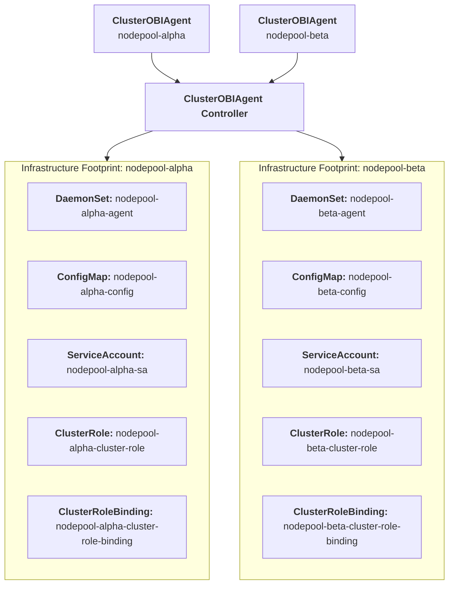
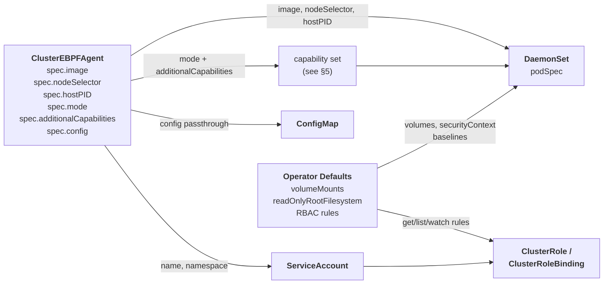

# Design Document: Introducing the ClusterEBPFAgent Controller

## 1. Summary

This proposal introduces a new cluster-scoped Custom Resource Definition (CRD) named `ClusterEBPFAgent` to the OpenTelemetry Operator. The goal is to automate the declarative provisioning and lifecycle management of OpenTelemetry’s eBPF out-of-process tracing engine (`otel/ebpf-instrumentation`). 

By standardizing this infrastructure layer into a dedicated controller, platform teams can unlock frictionless, language-agnostic HTTP/gRPC tracing and network topology tracking across application workloads without mutating tenant configurations, altering application binaries.

## 2. Motivation & Scope

The OpenTelemetry Operator currently handles application-level runtime SDK injections via the namespaced `Instrumentation` CRD and ingestion pipelines via `OpenTelemetryCollector`. However, it lacks a first-class, cluster-scoped automation pattern for host-level kernel telemetry generation.

Deploying and scaling eBPF daemons manually requires platform teams to handle complex Linux capability configurations, coordinate multi-tenant namespace filters, and manage specific vendor security permissions (such as Security Context Constraints on Red Hat OpenShift).

### Out of Scope / Boundaries of Responsibility
To ensure project scope safety and decouple maintenance loops, this architecture implements a **Shared Responsibility Model**:
* **Operator Domain:** The operator is exclusively responsible for the Kubernetes lifecycle automation (DaemonSet state, RBAC provisioning, platform-specific security matching).
* **eBPF SIG Domain:** The verification safety of the underlying BPF bytecode, user-space protocol translation efficiency, and Linux kernel version compatibility matrix remain strictly under the authority of the upstream eBPF Instrumentation SIG.

## 3. Architecture & Topology

The controller implements a **Standalone / Decoupled Deployment Topology**. The operator does not build or distribute a custom Collector binary. It deploys the official `otel/ebpf-instrumentation` daemon pool, which hooks the host kernel and streams raw OTLP metrics/traces natively over network sockets to a standard instance of the `OpenTelemetryCollector`.



## 4. Resource Configuration Model

Each `ClusterEBPFAgent` CR instance is reconciled into a deterministic set of child resources. The controller derives the final resource manifests from three input streams: the CR spec, an environment probe (OpenShift vs. vanilla Kubernetes), and hardcoded operator defaults.



### Field Mapping

| Output resource | Field | Source | Notes |
|---|---|---|---|
| DaemonSet | `spec.template.spec.containers[0].image` | `CR .spec.image` | Defaults to `otel/ebpf-instrument:v0.9.0` |
| DaemonSet | `spec.template.spec.nodeSelector` | `CR .spec.nodeSelector` | Empty map if unset |
| DaemonSet | `spec.template.spec.hostPID` | `CR .spec.hostPID` | Defaults to `true` |
| DaemonSet | `spec.template.spec.containers[0].securityContext.capabilities` | `CR .spec.mode` + `CR .spec.additionalCapabilities` | Derived deterministically; see §5 |
| DaemonSet | `spec.template.spec.volumes` | Operator default | `emptyDir` (var-run-obi), `hostPath` (cgroup), `configMap` (config) |
| DaemonSet | `spec.template.spec.containers[0].securityContext.readOnlyRootFilesystem` | Operator default | Always `true` |
| DaemonSet | `spec.template.spec.containers[0].securityContext.runAsUser` | Operator default | Always `0` |
| ConfigMap | `data["obi-config.yml"]` | `CR .spec.config` | Untyped passthrough; operator does not interpret content |
| ServiceAccount | `metadata.name` | CR name (prefixed) | e.g. `<cr-name>-sa` |
| ClusterRole | `rules` | Operator default | `get/list/watch` on pods, nodes, services, workload resources |
| ClusterRoleBinding | `subjects[0]` | Derived from ServiceAccount | |

## 5. Security Posture

OBI instruments the host kernel via eBPF and requires elevated privileges by design. This section defines exactly which privileges are granted, how they are derived, and why.

> **Operator vs. helm chart default:** The upstream helm chart defaults to `privileged: true` — an acknowledged [developer experience shortcut](https://github.com/grafana/beyla/pull/528) for local environments such as Kind and Docker Desktop. The operator deliberately does not inherit this default. It provisions the minimal capability set required for the declared operation mode, which is the intended production posture.

### 5.1 Host Namespaces

| Field | Value | Source | Rationale |
|---|---|---|---|
| `hostPID` | `true` | `CR .spec.hostPID` (default: `true`) | Required for cross-container process visibility; eBPF probes cannot resolve PIDs to workloads without it |

### 5.2 Linux Capabilities

The capability set is derived from two inputs: `spec.mode` selects the base set for the declared operation mode; `spec.additionalCapabilities` adds any user-supplied extras. The final set is their union.

```
BASE = { BPF, PERFMON, NET_RAW }

APP  = BASE ∪ { SYS_PTRACE, DAC_READ_SEARCH, CHECKPOINT_RESTORE }
NET  = BASE ∪ { NET_ADMIN }
FULL = APP  ∪ NET

final_capabilities = mode_set(spec.mode) ∪ spec.additionalCapabilities
```

| Capability | application | network | full | Rationale |
|---|:---:|:---:|:---:|---|
| `BPF` | ✓ | ✓ | ✓ | Load and attach eBPF programs |
| `PERFMON` | ✓ | ✓ | ✓ | Access perf events; load BPF programs (kernel ≥ 5.8) |
| `NET_RAW` | ✓ | ✓ | ✓ | `AF_PACKET` raw sockets for socket filter programs |
| `SYS_PTRACE` | ✓ | — | ✓ | Access `/proc/pid/exe`; inspect ELF binaries across container namespaces |
| `DAC_READ_SEARCH` | ✓ | — | ✓ | Access `/proc/self/mem` and ELF files across UID boundaries |
| `CHECKPOINT_RESTORE` | ✓ | — | ✓ | Access `/proc` symlinks for process and system info |
| `NET_ADMIN` | — | ✓ | ✓ | TC (`BPF_PROG_TYPE_SCHED_CLS`) programs for network monitoring and context propagation |
| `SYS_ADMIN` | — | — | — | Via `spec.additionalCapabilities` only; see note below |

> **`SYS_ADMIN`:** Required for Go library-level trace context propagation via `bpf_probe_write_user`. Also required on AKS and EKS, where `kernel.perf_event_paranoid > 1` by default, making `PERFMON` alone insufficient. Users on self-managed clusters who do not need Go distributed tracing can omit it. The operator sets `OTEL_EBPF_ENFORCE_SYS_CAPS=1` unconditionally so that any capability mismatch surfaces immediately as a pod failure rather than silently degraded telemetry.

### 5.3 Volume Mounts

| Volume | Type | Mount path | Rationale |
|---|---|---|---|
| `obi-config` | `ConfigMap` | `/config` (read-only) | Agent configuration passthrough |
| `var-run-obi` | `emptyDir` | `/var/run/obi` | Ephemeral socket between eBPF probe and user-space agent |
| `cgroup` | `hostPath: /sys/fs/cgroup` | `/sys/fs/cgroup` | cgroup membership resolution; maps sockets to container workloads |
| `kernel-security` | `hostPath: /sys/kernel/security` | `/sys/kernel/security` (read-only) | Kernel lockdown mode detection; determines whether `bpf_probe_write_user` is available under Secure Boot |